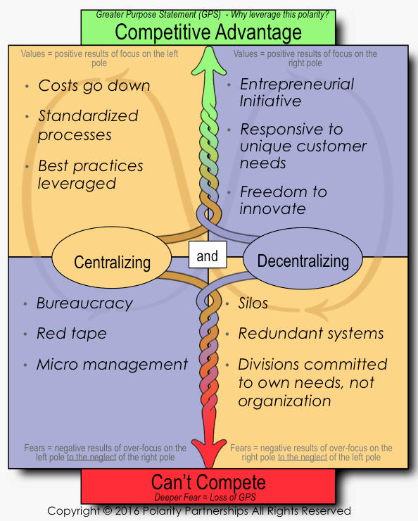

Title:  Software Development is a Balancing Act

Tags:   ideas

AKA:    balance

Seq:    2.4

Idea Number: 4

Level:  3 - Article

Class:  article

Timestamp: 20160614152009

Index:  absolutes; balance; Boehm, Barry; Davis, Alan M.; extremism; Goldwater, Barry; polarities; Polarity Management (http://www.polaritypartnerships.com/); risk management; Robertson, James and Suzanne; sacred cows; Turner, Richard; 

Body:

All software development involves trade-offs. This is equally true whether we're talking about development processes or software products. Trying to adhere to absolutes -- or to maximize one quality or performance factor while ignoring others -- will generally require you to pretend that these trade-offs don't exist, and sticking your head in this sort of sand is never a good idea.

Some of these trade-offs may be thought of as polarities. A polarity is most simply defined as a complex problem that has no solution. It might also be stated as an either/or question that has no single right answer. A more complete definition might be "A set of two opposing or contradictory extremes permitting wide variation along a spectrum of choices, with both opposing poles offering advantages and disadvantages."

The pros and cons of a polarity are often represented in the form of a polarity map, in which each quadrant represents the pros or cons of one pole or another, as in the following example. The flowing arrows are meant to represent the ongoing dynamic process of seeking the optimal balance point at which the pros are maximized and the cons are minimized.

If you are facing a polarity, then you will want to engage in <a href="http://www.polaritypartnerships.com/" class="reflink" target="ref">Polarity Management</a>, rather than trying to pick one pole or the other.

##### Polarity Examples

Let's look at some examples of what I mean.

###### 1. Requirements Detail

[[Alan M. Davis]] describes this polarity in his book <cite>[[Just Enough Requirements Management: Where Software Development Meets Marketing]]</cite>:

{:include-quote-body:Just Enough Attention to Requirements}

Suzanne and James Robertson <a href="http://www.infoq.com/articles/mastering-requirements-process" class="reflink" target="ref">speak to the same polarity</a> in their book, <cite>[[Mastering the Requirements Process]]</cite>, through use of animal analogies:

{:include-quote-body:Rabbit Projects vs. Elephant Projects}

###### 2. Agility vs. Discipline

In their book <cite>[[Balancing Agility and Discipline: A Guide for the Perplexed]]</cite>, [[Barry Boehm and Richard Turner]] frame this polarity using the following examples:

{:include-quote-body:Arguments for and against Agile}

###### 3. Project Size

Large projects can address more ambitious work statements and, in theory, can optimize their use of resources to deliver the most benefit for the least cost. Smaller projects, on the other hand, carry a higher probability of successful completion, and can deliver benefits in a more timely fashion.

According to a report from [[The Standish Group]]:

{:include-quote-body:Failures of Large Projects}

At the same time, breaking a large project into smaller chunks often introduces some inefficiencies, and so may tend to drive up overall costs and durations.

###### 4. Team Empowerment vs. Direction from Above

Teams that are overly constrained by their leadership are not likely to get much accomplished. On the other hand, teams that are given free rein to do whatever they think important may fail to meet objectives important to the organization as a whole.

###### 5. Pleasing the Customer

If a team doesn't please their primary customers, then they will not get very far. On the other hand, if they focus exclusively on pleasing their primary customers, then they may fail to meet governance and compliance requirements imposed on their projects by other stakeholders, and may overlook opportunities for breakthrough innovation.

###### 6. Invention vs. Reuse

Reuse of existing software can reduce costs, but can also put limits on a team's ability to innovate.

###### 7. Urgency vs. Careful Deliberation

Measuring twice before cutting once may reduce the potential for errors and rework, but delivering usable results quickly may meet pressing business needs more expeditiously than a long, deliberative development cycle.

###### 8. Predictive Accuracy vs. Speed of Execution

Doing careful estimates and refining them as you proceed will maximize your chances of performing to your plan. On the other hand, "Just Do It" may be more appropriate for efforts that need to complete quickly, even if their costs are higher than anticipated.

###### 9. Achievement of Strategic Goals vs. Tactical Objectives

Long-term strategic visions can offer compelling, sweeping changes, but achievement of short-term tactical objectives can often be done at lower cost and risk and with more timely and reliable delivery of benefits.

###### 10. High-Level vs. Low-Level Languages

Higher level languages such as Java often offer greater programmer productivity. On the other hand, low-level languages such as C can sometimes offer improved software execution speed.

##### Implications

Each of these polarities requires a project's leadership to strike a balance that maximizes the advantages for their particular project, and minimizes the disadvantages. All of these decisions involve trade-offs. There are no perfect answers. If you can approach polarities with this understanding, then you have a decent chance of coming up with reasonable answers that will allow your project to succeed. On the other hand, if you insist on making some of these poles sacred cows that can't be questioned, then your project is likely to run into problems.

Balancing these polarities appropriately requires judgment. Such judgment is usually best wielded by an individual, or a small group of like-minded leaders who work well together. Since an absolute principle often sounds intuitively more appealing than a balanced middle ground, larger groups and those less well acquainted with project details may have a harder time making these sorts of finely calibrated judgments. For this reason, in my experience, it is hard for projects to receive much of this sort of help from those working in executive leadership or governance or oversight roles, or from committees of any kind.

I have also found that traditional risk management often fails to help achieve appropriate balance on any of these polarities, since risk mitigation efforts often simply serve as rationalizations for staying the current course on the project, rather than making any true course corrections by re-balancing any of these polarities.

While Barry Goldwater may have famously said that "extremism in defense of liberty is no vice," I am strongly suggesting that extremism in defense of any of these poles on a software development project is very likely to be a vice. This is not to say that it's best to always proceed down the middle of the road, but that it's best to always have an informed, open-minded approach to achieving appropriate balance of all these polarities, in light of the characteristics of a particular project.

Software development is difficult enough under the best of circumstances. Turning any of these poles into absolute principles, to be defended as fundamental articles of faith, is likely to burden your software development project with more problems than it can handle.

[boehm-turner-2003]: bibliography.html#boehm-turner-2003
[davis-2005]: bibliography.html#davis-2005
[robertson-1999]: bibliography.html#robertson-1999
[standish-2013]: bibliography.html#standish-2013
